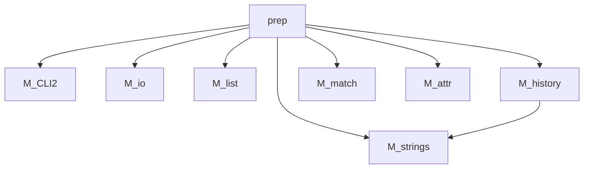

#### [fpm-tools](https://github.com/search?q="fpm-tools"%20in:topic%20language:fortran):[prep](https://urbanjost.github.io/prep/prep.1.html)

# 
## prep - A Fortran source code pre-processor written in Fortran

## Description
`prep(1)` is a streamlined pre-processor primarily designed for use with
Fortran. It does not support procedural macros but does support variable
substitution and reusable free-format text blocks which allows for basic
templating and easy construction of multi-line CHARACTER variables;
and is quite capable of supporting traditional conditional compilation.

It is written in standard Fortran so those in the Fortran community will
find it easy to modify and to use portably.

`prep(1)` is intentionally simple enough to be well described with
a one-page crib sheet, and should take no more than an hour to
master. Fortran-like (and some POSIX shell-like) syntax is used to
leverage familiarity with Fortran.

In particular, `prep(1)` allows for maintaining documentation in the body
of the source code in a variety of formats via the __$BLOCK__ directive.

## Example Showing Templating

The most distinct feature of **prep(1)** compared to basic preprocessors
is the ability to define a block of text and apply special processing
to it to simplify maintaining documentation but also to repeat the code
with different string expansions, allowing for a form of templating a
generic routine. A relatively advanced example:

```text
$import USER
$! write the routine generically with ${NAME} variables
$parcel ex1
   ! created by ${USER} on ${DATE} at ${TIME}
   subroutine testit_${KIND}(value)
   real(kind=${KIND}) :: value
      write(*,*)'big subroutine with type ${KIND} and value=',value
   end subroutine testit_${KIND}

$endparcel
$!
module M_testit
use, intrinsic :: iso_fortran_env, only : real32, real64, real128
implicit none
private
public testit
interface testit
   module procedure testit_real32
   module procedure testit_real64
   module procedure testit_real128
end interface testit
contains
$! now just $POST the routine multiple times changing the kind ...
$set kind real32
$post ex1
$set kind real64
$post ex1
$set kind real128
$post ex1
end module M_testit
```
The output looks like
```fortran
module M_testit
use, intrinsic :: iso_fortran_env, only : real32, real64, real128
implicit none
private
public testit
interface testit
   module procedure testit_real32
   module procedure testit_real64
   module procedure testit_real128
end interface testit
contains
   ! created by urbanjs on Jun 19 2021 at 11:55:43
   subroutine testit_real32(value)
   real(kind=real32) :: value
      write(*,*)'big subroutine with type real32 and value=',value
   end subroutine testit_real32

   ! created by urbanjs on Jun 19 2021 at 11:55:43
   subroutine testit_real64(value)
   real(kind=real64) :: value
      write(*,*)'big subroutine with type real64 and value=',value
   end subroutine testit_real64

   ! created by urbanjs on Jun 19 2021 at 11:55:43
   subroutine testit_real128(value)
   real(kind=real128) :: value
      write(*,*)'big subroutine with type real128 and value=',value
   end subroutine testit_real128

end module M_testit
```
## Building
To build it requires `git`, `fpm`(Fortran Package Manager), a modern
Fortran compiler and WWW access or you will need to compile the single-file
[bootstrap version](https://raw.githubusercontent.com/urbanjost/prep/main/standalone/prep.f90).
It was tested with


   + GNU Fortran (GCC) 8.3.1         on 20191121
   + GNU Fortran 9.3.0               on 20210612
   + GNU Fortran 10.3.0              on 20220804
   + GNU Fortran 11.1.0              on 20230120
   + ifort (IFORT) 19.1.3.304        on 20200925
   + ifort (IFORT) 2021.3.0 20210609 on 20220305
   + ifort (IFORT) 2021.3.0 20210609 on 20220804
   + ifort (IFORT) 2021.8.0 20221119 on 20230120
   + nvfortran 21.5-0                on 20220804

## Accessing
```bash
   # go to where you want to create the `prep` directory. For example:
   mkdir github
   cd github
   # get a clone of the repository
   git clone https://github.com/urbanjost/prep.git
   # enter the repository directory
   cd prep
```
## Building and Installing
```bash
   # build and install (in the default location) using fpm(1)
   fpm install
```
or
```bash
   # examples of building standalone version
   gfortran standalone/prep.f90 -o prep 
   ifort standalone/prep.f90 -o prep 
   nvfortran -Mbackslash standalone/prep.f90 -o prep 
   # example of moving to a location in your path
   mv prep $HOME/.local/bin/
```
## Try It
```bash
   # if you placed the program in a directory in your command path you are ready to go!
   prep --help
```
## Without intermediate files

  Normally, you would run prep to make your standard source file, like a \*.f90 file.
  Mileage may vary, but for some common Fortran compilers you can directly compile
  your files; at least in simple cases. 
```bash
  prep -i $FILE.FF |gfortran -x f95 -  # free-format Fortran
  prep -i $FILE.FF |gfortran -x f77 -  # fixed-format Fortran
```
<!--
  ifort -fpp-name='prep' $FILE.F90
-->
  Preprocessing is not standardized, so creating .f90 and .f files is probably far
  more reliable.

## Documentation   
 + [man-pages](https://urbanjost.github.io/prep/prep.1.html) reformatted as HTML.
 + the [demos/](https://github.com/urbanjost/prep/tree/main/demos/) directory has example input files for a variety of cases
 + The [CHANGELOG](https://github.com/urbanjost/prep/blob/main/docs/CHANGELOG.md)
 + The [CI/CD](https://github.com/urbanjost/prep/blob/main/docs/STATUS.md) results
 + Developer [ford(1) output](https://urbanjost.github.io/prep/fpm-ford/index.html)
 + [Overview](https://urbanjost.github.io/prep)

## Crib Sheet
```text
EXPRESSIONS
  numeric operators are +,-,*,/,**, (). Logical operators are
   >  | .EQ.| .NE.| .GE.| .GT.| .LE.| .LT.|.NOT.|.AND.| .OR.| .EQV.|.NEQV.|
   >  |  == |  /= |  >= |  >  |  <= |  <  |  !  |  && |  || |  ==  |  !=  |
  $DEFINE variable_name[=expression][;...]
   > Predefined values are "OS", which is set to a guess of the system type, and
   > UNKNOWN=0 LINUX=1 MACOS=2 WINDOWS=3 CYGWIN=4 SOLARIS=5 FREEBSD=6 OPENBSD=7.
   > SYSTEMON is .TRUE. if --system is present on the command line, else .FALSE.
  $UNDEFINE|$UNDEF variable_name[;...]
CONDITIONAL CODE SELECTION:
  $IF logical_integer-based_expression| [.NOT.] DEFINED(varname[,...])
  $IFDEF|$IFNDEF variable_or_envname
  $ELSEIF|$ELIF logical_integer-based_expression
  $ELSE
  $ENDIF
MACRO STRING EXPANSION AND TEXT REPLAY:
   > Unless at least one variable name is defined no ${NAME} expansion occurs.
  $SET varname string
  $$UNSET variable_name[;...]
  $IMPORT envname[;...]
   > $set author  William Shakespeare
   > $import HOME
   > write(*,*)'${AUTHOR} ${DATE} ${TIME} File ${FILE} Line ${LINE} HOME ${HOME}
  $PARCEL blockname ... $ENDPARCEL ! a reuseable parcel of expandable text
  $POST   blockname(s)  ! insert a defined parcel of text
EXTERNAL FILES (see $BLOCK ... --file also)
  $OUTPUT filename [--append]
  $INCLUDE filename
TEXT BLOCK FILTERS (--file writes to $PREP_DOCUMENT_DIR/doc/NAME)
  $BLOCK [comment|null|write|variable [--varname NAME]|set|system|message|
         define|help|version][--file NAME [--append]] ... $ENDBLOCK
INFORMATION
  $MESSAGE message_to_stderr
  $SHOW [defined_variable_name][;...]
SYSTEM COMMANDS (see also: $BLOCK SYSTEM)
  $SYSTEM command
  $STOP [stop_value[ "message"]] | $QUIT ["message"]| $ERROR ["message"]
```
## Homepage
https://github.com/urbanjost/prep.git

Feedback is welcome.
[**leave a comment!**](https://github.com/urbanjost/prep/wiki/Fortran-pre-processing)

<!--
https://github.com/fortran-lang/fpm/issues/78
-->
## Dependencies ( via [fpm-deps](https://github.com/ivan-pi/fpm-deps))

