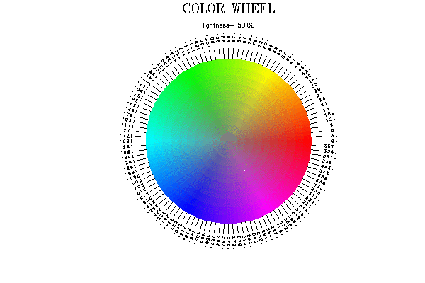

A sample file showing a markdown file containing prep(1) Fortran
file that can be extracted by using "fpm -type md ....". _TOTALLY
EXPERIMENTAL__ -- not yet a supported feature.



NAME
====
**color\_wheel**(1f) - \[M\_draw\] generate HLS color wheels
(LICENSE:PD)

SYNOPSIS
========
**color\_wheel** \[ **\--help**\| **\--version**\]

DESCRIPTION
===========
Generates color wheels using the HLS (Hue Lightness, Saturation) model.

Note that if the output device does not support at least 1200 colors in
the color table that output will appear incorrect.

OPTIONS
=======
**\--help**

:   display this help and exit

**\--version**

:   output version information and exit

EXAMPLE
=======
Sample usage

       # generate Adobe PDF document
       export M_DRAW_FONTLIB=/usr/share/hershey
       export M_DRAW_DEVICE=pdf
       color_wheel
       # display PDF file using an Adobe PDF viewer
       xpdf look.hue  

AUTHOR
======

John S. Urban

LICENSE
=======

Public License
```fortran
program huedisk
!(LICENSE:PD)
use M_draw
implicit none
real              :: lightness
real              :: lightstep
integer           :: ii
integer,parameter :: slice_count=120
integer,parameter :: ring_count=10

   call voutput('look.hue')
   ! might want to set this for PPM drivers or X11, but too small for PostScript
   ! call prefsize(800,800)
   call vinit(' ')
   call color(0)
   call clear()
   call color(7)
   call page(-110./2.,85./2.,-110./2.,110./2.)
   call polyfill(.true.)
   call vflush()
   call vsetflush(.false.)
   lightness=50
   call wheel(lightness)

   lightness=100.0
   lightstep=-5
   do ii=1,19
      call wheel(lightness)
      LIGHTNESS=LIGHTNESS+LIGHTSTEP
   enddo
   call vsetflush(.true.)
   call vexit()
contains

subroutine wheel(lightness) ! draw an entire wheel
use M_draw
real              :: lightness
character(len=40) :: line
real              :: hue_val
integer           :: ii
integer           :: idum
   call textang(0.0)
   call color(7)
   call textsize(5.0,6.0)
   call font('times.r')
   call fixedwidth(.false.)
   call move2(0.0,103.0/2.0)
   call centertext(.true.)
   call linewidth(30)
   call drawstr('COLOR WHEEL')
   call linewidth(0)
   call textsize( 2.5,2.5)
   call font('futura.l')
   call move2(0.0,90.0/2.0)
   write(line,'("lightness=",f6.2)')lightness
   call linewidth(30)
   call drawstr(line)
   call linewidth(0)
   call fixedwidth(.true.)
   call textsize(1.5,1.5)
   hue_val=0
   do ii=slice_count, 1,-1
      call slice(hue_val,lightness)
   enddo
   call centertext(.false.)
   idum=getkey()
   call color(0)
   call clear()
   call color(7)
   call vflush()
end subroutine wheel

subroutine slice(hue_val,lightness0) ! draw a slice
use m_units, only: d2r
use m_color, only: hue
use M_draw
integer             :: buffer
real                :: hue_val, ang_inc
real                :: lightness,lightness0

character(len=40)   :: line
real                :: step
real                :: X1, X2, X3, X4
real                :: Y1, Y2, Y3, Y4

integer             :: maxcolors, current_color
integer             :: ir, ig, ib
real                :: r,g,b
real                :: saturation

integer             :: status
integer             :: icount
real                :: angle1, angle2
real                :: radius1, radius2, radius3, radius4

integer,save        :: color_count=0

   lightness=lightness0

   buffer=8
   ANG_INC=360.0/real(SLICE_COUNT)
   angle1=hue_val-ANG_INC/2
   angle2=angle1+ANG_INC
   saturation=100
   radius1=32
   radius3=radius1+4
   radius4=radius1+7
   ! draw tic from wheel to start of angle label
   call color(7)
   call linewidth(40)
   call move2( radius1*cos(d2r(hue_val)), radius1*sin(d2r(hue_val)))
   call draw2( radius3*cos(d2r(hue_val)), radius3*sin(d2r(hue_val)))
   ! draw degree label at tic
   call textang(hue_val)
   call move2(radius4*cos(d2r(hue_val)),radius4*sin(d2r(hue_val)))
   write(line,'(f5.0)')hue_val
   call linewidth(20)
   call drawstr(line)
   call linewidth(0)
   step=radius1/real(ring_count)
   radius2=radius1-step
   ! draw a chunk in a slice
   MAXCOLORS=(2**(getdepth()-1))-buffer
   do icount=ring_count+1,1,-1
      CURRENT_COLOR=MOD(color_count,MAXCOLORS)+buffer  ! add buffer to leave base colors alone
      color_count=color_count+1
      ! fancy mapcolor
      call hue("hls",hue_val,lightness,saturation,"rgb",r,g,b,status)
      ir=int(r*255.0/100.0+0.50)
      ig=int(g*255.0/100.0+0.50)
      ib=int(b*255.0/100.0+0.50)
!      write(*,*)'===== set color ',current_color,hue_val,lightness,saturation,ir,ig,ib
      call mapcolor(CURRENT_COLOR,ir,ig,ib)
      call color(CURRENT_COLOR)

      X1=cos(d2r(angle1))*radius2
      Y1=sin(d2r(angle1))*radius2
      X2=cos(d2r(angle1))*radius1
      Y2=sin(d2r(angle1))*radius1
      X3=cos(d2r(angle2))*radius2
      Y3=sin(d2r(angle2))*radius2
      X4=cos(d2r(angle2))*radius1
      Y4=sin(d2r(angle2))*radius1

      call makepoly()
      call move2(X1,Y1)
      call draw2(X2,Y2)
      call draw2(X4,Y4)
      call draw2(X3,Y3)
      ! should you close it yourself or let M_DRAW close it?
      ! get errors if close it yourself, which you should not
      !call draw2(X1,Y1)
      call closepoly()

      saturation=saturation-100.0/real(ring_count)
      radius1=radius2
      radius2=radius1-step
   enddo
   hue_val=hue_val+ANG_INC
end subroutine slice

end program huedisk
```
## USAGE NOTES
```bash
# assuming you are in an fpm project set up with M_graph
# as a dependency and this file is in the demos/ directory
# and you have prep, the NetPBM package, or ImageMagik, and pandoc(1):

prep -type md -i demos/color_wheel.md -o app/color_wheel.f90

# run the program to Poskanker pixel map and convert to GIF
export M_DRAW_DEVICE=p6
fpm run color_wheel
ppmquant 256 < look.hue | ppmtogif > x.gif
# or using ImageMagic one of several ways is 
display look.hue
# and save in your preferred image type

# convert the markdown file to HTML5 or PDF using a utility
# such as pandoc

pandoc -f markdown -t latex -o docs/color_wheel.pdf -i demos/color_wheel.md
```
<!--
2022-03-04
-->
